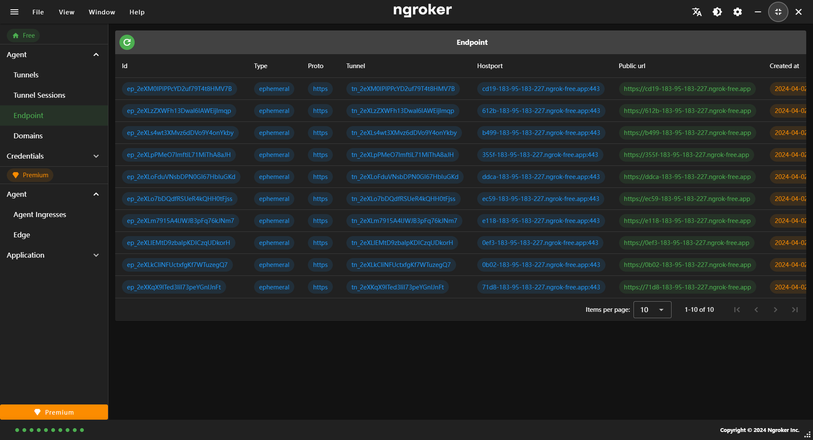

## Endpoints

An Endpoint is the access point for anything you use with ngroker. Endpoints include Domains and TCP addresses for apps and services you deliver online, or devices you connect to with ngroker.

