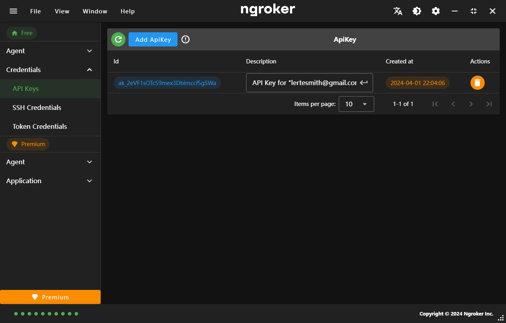
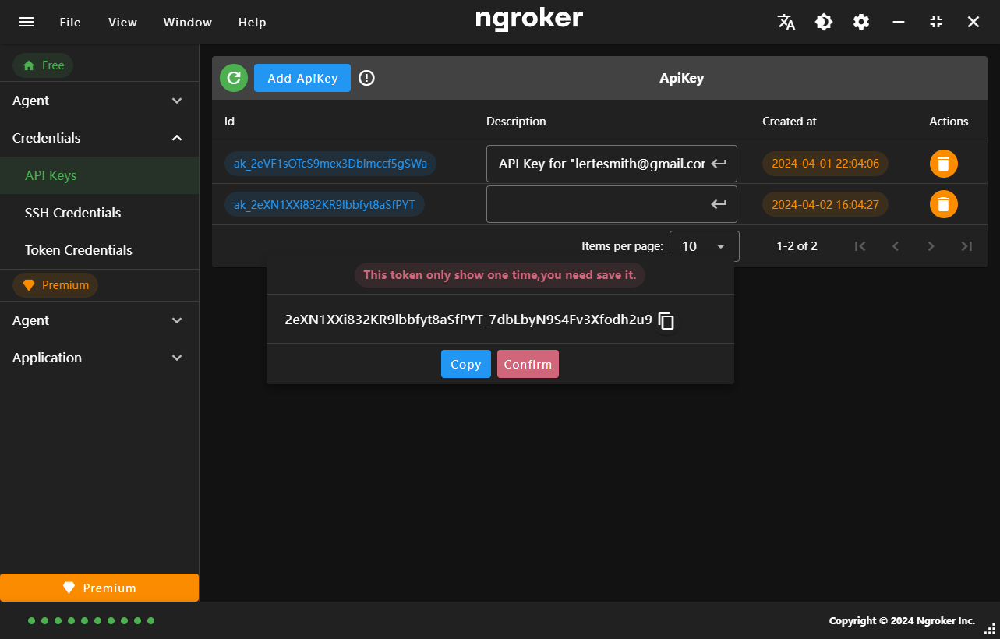

## API keys

API keys are used to authenticate requests to the API.

## Add API keys

<strong className="text-red-500">
  Once the api keys is returned, you will be prompted to save it to a file. This
  is the last time the token will be shown. Please save it securely to your
  machine.
</strong>

