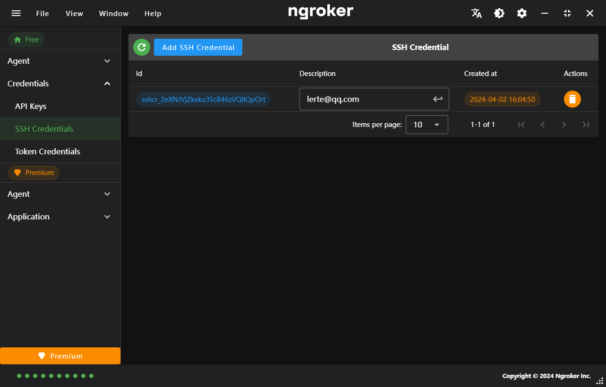
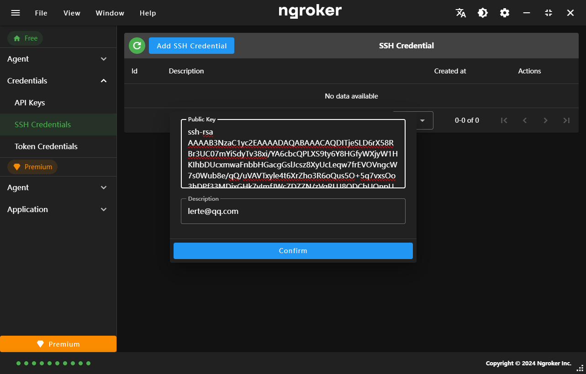

## SSH Credentials

Add an SSH public key to start tunnels via SSH reverse tunneling (ssh -R). This is a way to start tunnels without downloading or running the ngrok agent.

After you've added your public key, run ssh -R 443:localhost:80 tunnel.us.ngrok.com http to start a tunnel.

## Add SSH Credentials

<strong className="text-red-500">
  Generally public keys begins with 'ssh-rsa', 'ssh-ed25519',
  'ecdsa-sha2-nistp256', 'ecdsa-sha2-nistp384', or 'ecdsa-sha2-nistp521'
</strong>

