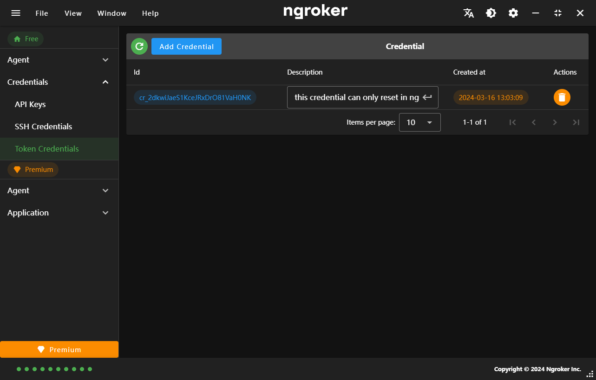
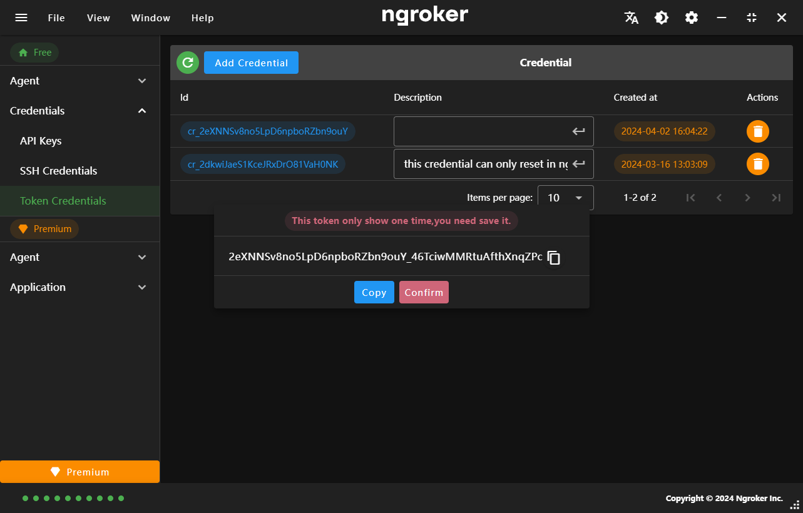

## Token Credentials

Authtokens connect ngrok agents to your ngrok account. You should provision a unique authtoken for every installed ngrok agent. This allows for fine-grained permissions management via ACLs and easy revocation if a machine is compromised or deactivated.

## Add Token Credentials

<strong className="text-red-500">
  Once the token is returned, you will be prompted to save it to a file. This is
  the last time the token will be shown. Please save it securely to your
  machine.
</strong>

