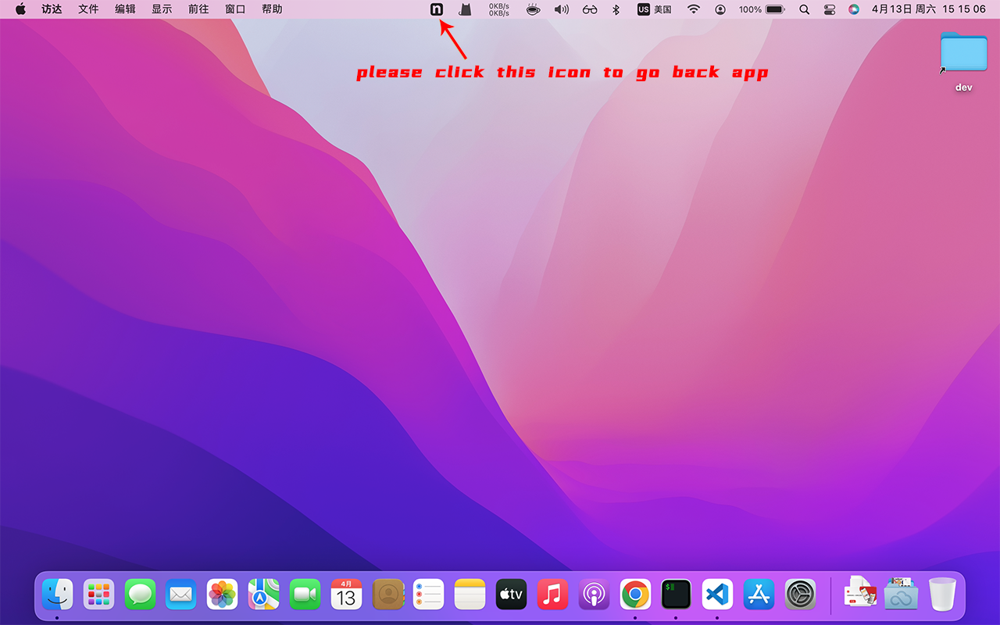

# Windows

> If windows show **Windows protected your PC**

Click **More info** -> **Run anyway**

# macOS

> If you can not launch on macOS after drop app into /Application folder, try to run the command below on terminal

`sudo xattr -d com.apple.quarantine /Applications/Ngroker.app`

> If you minimize the app, you can't find the app on dock, please check the top of status bar.
> 
