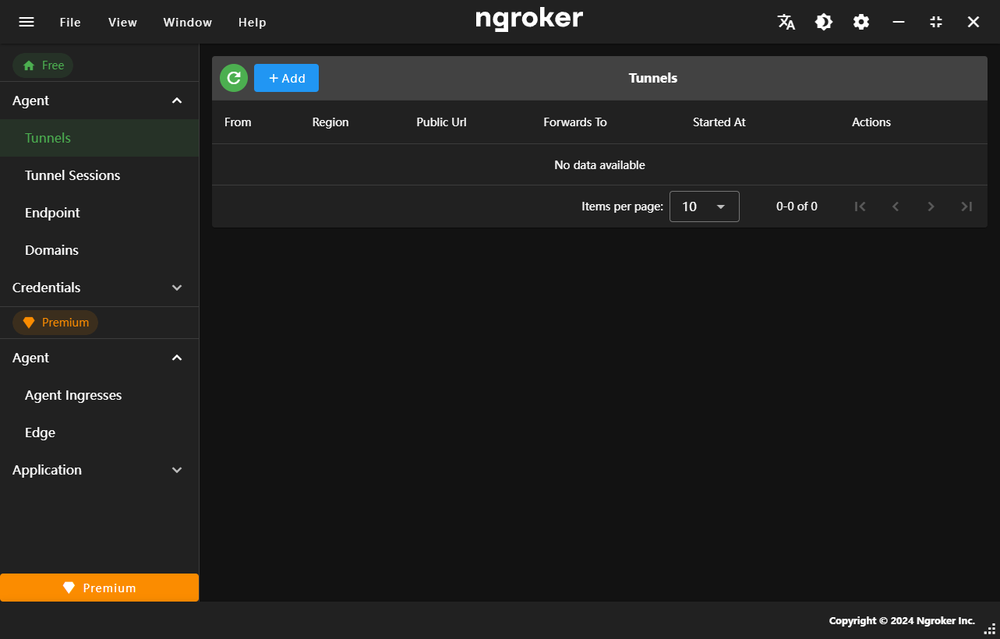

# Introduction

Ngroker is a gui client for ngrok. It is a simple and easy to use tool to create tunnels to localhost.

## What is Ngroker?

First of all **[ngrok](https://ngrok.com)** is a unified ingress platform for developers that offer a cli tool for creates tunnels to localhost. It is a useful tool for developers who want to test their applications locally.

And then **ngroker** is a gui client base on ngrok, wrapped the ngrok single binaray file to an app. Make controling ngrok easier. And also integrated ngrok's api.

## Features

- **Auto Dark Mode**: Ngroker automatically switches to a dark theme for better visibility on system prefers-color-scheme.
- **Internationalization**: Ngroker supports multiple languages, including English, Chinese, and Japanese.
- **Compatible with ngrok**: Ngroker is compatible with the ngrok agent CLI, allowing users to take advantage of both the CLI and the GUI.
- **Api Integrated**: Ngroker integrates with ngrok's API, allowing users to easily manage their tunnels and configurations.
- **Easy to Use**: Ngroker is designed to be user-friendly, with a simple and intuitive interface.

